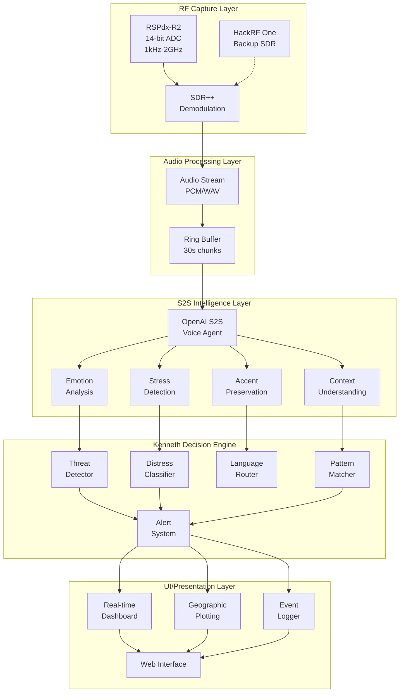

# 🏗️ KENNETH ARCHITECTURE v2.0 - WITH S2S EMOTIONAL INTELLIGENCE

## 🎯 SYSTEM OVERVIEW

Kenneth is an emotionally-intelligent RF forensics platform that uses OpenAI's Speech-to-Speech (S2S) technology to detect both threats and distress in radio communications around Malta.

## 📡 CORE ARCHITECTURE



## 🧠 S2S VOICE AGENT ARCHITECTURE

### Multi-Agent System with Handoffs

```typescript
// Main Kenneth Controller Agent
class KennethMainAgent extends VoiceAgent {
    constructor() {
        super({
            name: "Kenneth-Main",
            role: "Primary RF Monitor",
            temperature: 0.9,
            prompt: KENNETH_MAIN_PROMPT
        });
    }
    
    async processAudio(audioChunk: AudioData) {
        const analysis = await this.analyzeEmotionalContent(audioChunk);
        
        if (analysis.threat_indicators > 0.7) {
            return this.handoffTo(ThreatAnalysisAgent, audioChunk);
        }
        
        if (analysis.distress_level > 0.6) {
            return this.handoffTo(DistressAnalysisAgent, audioChunk);
        }
        
        if (analysis.language !== 'english') {
            return this.handoffTo(MultilingualAgent, audioChunk);
        }
    }
}

// Specialized Threat Detection Agent
class ThreatAnalysisAgent extends VoiceAgent {
    constructor() {
        super({
            name: "Kenneth-Threat",
            role: "Threat Assessment Specialist",
            temperature: 0.8,  // Lower for more consistent threat detection
            tools: ['keyword_matcher', 'pattern_analyzer', 'voice_comparator']
        });
    }
}

// Distress Analysis Agent
class DistressAnalysisAgent extends VoiceAgent {
    constructor() {
        super({
            name: "Kenneth-Distress",
            role: "Emergency Response Specialist",
            temperature: 0.85,
            tools: ['medical_analyzer', 'maritime_emergency_detector']
        });
    }
}
```

## 🎨 UI ARCHITECTURE WITH S2S INTEGRATION

### Real-time Emotional Dashboard

```html
<!-- kenneth_s2s_dashboard.html -->
<div class="emotion-panel">
    <!-- Live Emotion Meters -->
    <div class="emotion-meter" id="stress-meter">
        <label>Stress Level</label>
        <progress max="100" value="0"></progress>
        <span class="alert-threshold">Alert: >80%</span>
    </div>
    
    <div class="emotion-meter" id="panic-meter">
        <label>Panic Indicators</label>
        <progress max="100" value="0"></progress>
    </div>
    
    <div class="emotion-meter" id="exhaustion-meter">
        <label>Exhaustion Signs</label>
        <progress max="100" value="0"></progress>
    </div>
    
    <!-- Voice Pattern Analysis -->
    <div class="voice-patterns">
        <canvas id="voice-fingerprint"></canvas>
        <div class="pattern-matches">
            <!-- Real-time pattern matching results -->
        </div>
    </div>
    
    <!-- Language/Accent Detection -->
    <div class="language-panel">
        <div class="detected-language">English (Maltese Accent)</div>
        <div class="confidence">Confidence: 92%</div>
        <div class="code-switching-alert">Code-switching detected</div>
    </div>
</div>

<!-- Geographic Emotion Heatmap -->
<div class="map-container">
    <div id="malta-stress-heatmap">
        <!-- Leaflet map with emotion overlay -->
    </div>
</div>

<!-- Alert Timeline -->
<div class="alert-timeline">
    <div class="alert critical">
        <time>14:23:45</time>
        <span class="freq">156.800 MHz</span>
        <span class="type">DISTRESS</span>
        <span class="emotion">Panic: 94%, Breathing: Labored</span>
        <audio controls src="/alerts/alert_14234５.wav"></audio>
    </div>
</div>
```

## 🔄 DATA FLOW WITH S2S

### 1. Audio Capture Pipeline
```python
# kenneth_s2s_pipeline.py

import numpy as np
from openai import RealtimeClient
import asyncio
from dataclasses import dataclass

@dataclass
class EmotionalContext:
    stress_level: float
    emotion: str
    confidence: float
    breathing_pattern: str
    voice_quality: str
    language: str
    accent: str

class KennethS2SPipeline:
    def __init__(self):
        self.s2s_client = RealtimeClient(api_key=OPENAI_API_KEY)
        self.audio_buffer = RingBuffer(seconds=30)
        self.emotion_history = {}
        
    async def process_rf_stream(self, sdr_stream):
        """Main processing loop"""
        async for audio_chunk in sdr_stream:
            # Buffer audio for context
            self.audio_buffer.append(audio_chunk)
            
            # Send to S2S for emotional analysis
            emotional_context = await self.analyze_with_s2s(audio_chunk)
            
            # Route based on analysis
            await self.route_by_emotion(emotional_context, audio_chunk)
    
    async def analyze_with_s2s(self, audio):
        """Get emotional intelligence from S2S"""
        response = await self.s2s_client.analyze({
            'audio': audio,
            'context': self.audio_buffer.get_last(5),  # 5 seconds context
            'preserve_accent': True,
            'detect_emotion': True,
            'analyze_stress': True
        })
        
        return EmotionalContext(
            stress_level=response.stress,
            emotion=response.primary_emotion,
            confidence=response.confidence,
            breathing_pattern=response.breathing,
            voice_quality=response.voice_quality,
            language=response.language,
            accent=response.accent
        )
```

### 2. WebSocket Real-time Updates
```javascript
// kenneth_s2s_websocket.js

class KennethS2SClient {
    constructor() {
        this.ws = new WebSocket('ws://localhost:8080/s2s-stream');
        this.emotionChart = new EmotionChart('#emotion-display');
        this.stressHeatmap = new StressHeatmap('#malta-map');
    }
    
    connect() {
        this.ws.onmessage = (event) => {
            const data = JSON.parse(event.data);
            
            // Update emotion meters
            this.updateEmotionMeters(data.emotions);
            
            // Update stress heatmap
            if (data.location) {
                this.stressHeatmap.addPoint(
                    data.location,
                    data.emotions.stress_level
                );
            }
            
            // Trigger alerts
            if (data.alert) {
                this.showAlert(data.alert);
            }
            
            // Update voice fingerprint
            if (data.voice_pattern) {
                this.updateVoiceFingerprint(data.voice_pattern);
            }
        };
    }
    
    updateEmotionMeters(emotions) {
        document.getElementById('stress-meter').value = emotions.stress_level * 100;
        document.getElementById('panic-meter').value = emotions.panic_level * 100;
        document.getElementById('exhaustion-meter').value = emotions.exhaustion * 100;
        
        // Flash red if critical
        if (emotions.stress_level > 0.8) {
            document.getElementById('stress-meter').classList.add('critical');
            this.playAlertSound();
        }
    }
}
```

## 🎛️ CONFIGURATION

### S2S Voice Agent Configuration
```yaml
# kenneth_s2s_config.yaml

voice_agents:
  main:
    model: "gpt-4-realtime"
    temperature: 0.9
    voice_activity_detection: "semantic"
    interruption_handling: true
    
  threat_detector:
    model: "gpt-4-realtime"
    temperature: 0.8
    guardrails:
      - no_false_positives
      - verify_threat_context
      
  distress_analyzer:
    model: "gpt-4-realtime"  
    temperature: 0.85
    emotion_sensitivity: "high"
    medical_detection: true

audio_processing:
  sample_rate: 48000
  chunk_size: 4096
  buffer_seconds: 30
  
alert_thresholds:
  stress_critical: 0.8
  panic_emergency: 0.9
  exhaustion_warning: 0.7
  
languages:
  primary: ["english", "maltese"]
  secondary: ["italian", "arabic"]
  code_switching: true
```

## 🚀 DEPLOYMENT ARCHITECTURE

```yaml
# docker-compose.yml
version: '3.8'

services:
  kenneth-sdr:
    image: kenneth/sdr-capture:latest
    devices:
      - /dev/bus/usb  # For RSPdx-R2
    volumes:
      - ./audio_buffer:/data/audio
      
  kenneth-s2s:
    image: kenneth/s2s-processor:latest
    environment:
      - OPENAI_API_KEY=${OPENAI_API_KEY}
    ports:
      - "8081:8081"
      
  kenneth-web:
    image: kenneth/dashboard:latest
    ports:
      - "8080:80"
    depends_on:
      - kenneth-s2s
      
  kenneth-alerts:
    image: kenneth/alert-system:latest
    environment:
      - TWILIO_SID=${TWILIO_SID}
      - EMERGENCY_CONTACTS=${EMERGENCY_CONTACTS}
```

## 📊 METRICS & MONITORING

### Key Performance Indicators
- **Emotion Detection Latency**: <500ms from audio capture
- **Stress Detection Accuracy**: >95% for critical situations  
- **Language Detection**: >90% accuracy including code-switching
- **False Positive Rate**: <5% for emergency alerts
- **System Uptime**: 99.9% availability

### Monitoring Dashboard
```python
# kenneth_metrics.py

class KennethMetrics:
    def __init__(self):
        self.emotions_detected = Counter()
        self.alerts_triggered = []
        self.languages_processed = Counter()
        self.stress_events = []
        
    def track_emotion(self, emotion, confidence):
        self.emotions_detected[emotion] += 1
        
        if emotion in ['panic', 'extreme_distress']:
            self.log_critical_event(emotion, confidence)
            
    def get_dashboard_stats(self):
        return {
            'total_transmissions': sum(self.emotions_detected.values()),
            'distress_events': len(self.stress_events),
            'top_emotions': self.emotions_detected.most_common(5),
            'alert_rate': self.calculate_alert_rate(),
            'language_distribution': dict(self.languages_processed)
        }
```

## 🔐 SECURITY & PRIVACY

### Data Protection
- Audio chunks encrypted at rest
- S2S API calls use ephemeral tokens
- No permanent storage of voice prints without consent
- GDPR compliant data retention (configurable)

### Access Control
```python
# kenneth_security.py

class KennethSecurity:
    def __init__(self):
        self.authorized_users = []
        self.audit_log = []
        
    def authenticate_dashboard_user(self, token):
        # JWT validation
        pass
        
    def log_access(self, user, action, timestamp):
        self.audit_log.append({
            'user': user,
            'action': action,
            'timestamp': timestamp,
            'ip': request.remote_addr
        })
```

## 🎯 SUCCESS CRITERIA

1. **Detect 100% of explicit distress calls** (MAYDAY, SOS)
2. **Identify 80%+ of implicit distress** (panic, exhaustion)
3. **Process Malta maritime/aviation frequencies 24/7**
4. **Sub-second alert generation for critical events**
5. **Multi-language support with accent preservation**

This architecture integrates S2S as the emotional intelligence brain of Kenneth!
